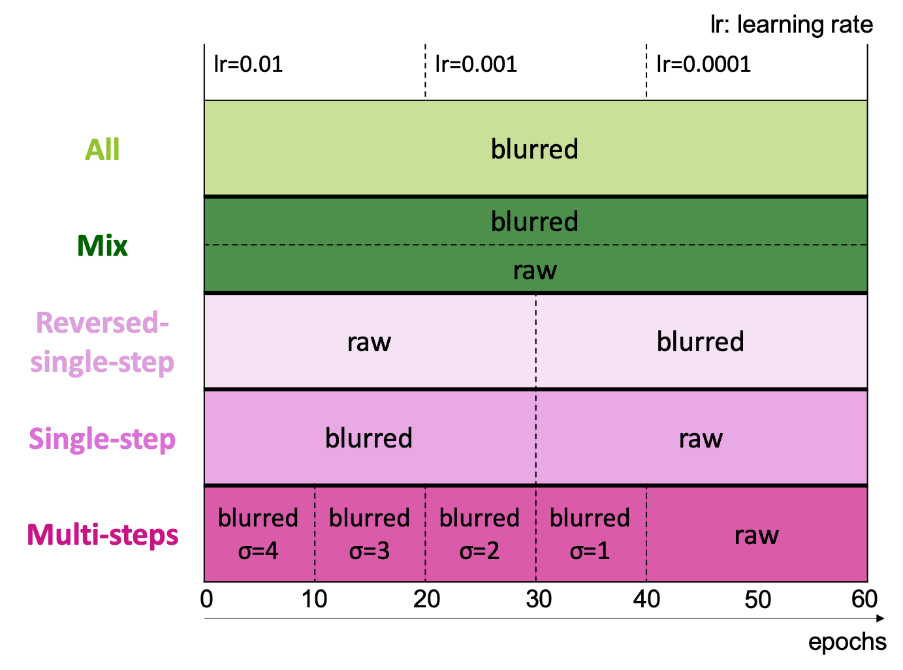

# Blur-Training with ImageNet 


## Blurred images (GaussianBlur)
Training images are blurred by Gaussian function. The images are more blurred as std.(σ) of Gaussian kernel is bigger.


## Schedule
You can try different training schedule as for blurring images. Here is an overview of the training schedule:



## Preparation
- Install Python Packages  
```bash
$ pip install -r requirements.txt
```
Or pull and run [docker image][docker-blur-training] (e.g. blur-training:latest) I made for this training.  
- Get ImageNet images & set the path. If you already have ImageNet, set `IMAGENET_PATH` variable in `training/main.py`.  
If not, Download the ImageNet dataset from http://www.image-net.org/  
    (Note that the ImageNet images need to be divided in two subdirectories, ``train/`` and ``val/``.)  
    Then set the path.
    
    
## run examples
General usage example:
```bash
$ cd training
$ python main.py --arch [ARCHITECTURE NAME] --mode [TRAINING MODE] -n [EXPERIMENT NAME] 
```  

For `main.py`, you need to use `--exp-name` or `-n` option to define your experiment's name. 
Then the experiment's name is used for managing results under `logs/` directory.
`logs/` will automatically be created when you run `main.py`.   
You can choose the training mode from:   
`normal, all, mix, reversed-single-step, single-step, multi-steps`  
by using `--mode [TRAINING MODE]` option.

- **normal**  
This mode trains Normal model (default: AlexNet).  
usage example:  
```bash
$ python main.py --arch alexnet --mode normal -e 60 -b 64 --lr 0.01 -n alexnet_normal
```

- **all**  
This mode blurs ALL images in the training mode.  
usage example:  
```bash
$ python main.py --arch alexnet --mode all -s1 -n alexnet_all_s1
```

- **mix**    
This mode blurs half training data.
usage example:  
```bash
$ python main.py --arch alexnet --mode mix -s 1 -n alexnet_mix_s1
```

- **single-step**    
This mode blurs first half epochs (e.g. first 30 epochs in 60 entire epochs) in the training.
usage example:  
```bash
$ python main.py --arch alexnet --mode single-step -s 1 -n alexnet_single-step_s1
```

- **multi-steps**  
This mode blurs images step by step (e.g. every 10 epochs).  
usage example:  
```bash
$ python main.py --arch alexnet --mode multi-steps -n alexnet_multi-steps
```

- `--blur-val`   
This option blurs validation data as well. 
usage example:  
```bash
$ python main.py --arch alexnet --mode mix -s 4 --blur-val -n alexnet_mix_lur-val_s4
```

- `--resume [PATH TO SAVED MODEL]`   
This option trains your saved model starting from the latest epoch.  
usage example:  
```bash
$ python main.py --arch alexnet --mode mix -s 4 --resume ../logs/models/alexnet_mix_s4/model_060.pth.tar -n alexnet_mix_s4_from60e 
```

## citation
Training scripts and functions are based on [pytorch tutorial][pytorch-tutorial] and [pytorch imagenet trainning example][pytorch-imagenet].


[pytorch-tutorial]:https://github.com/pytorch/tutorials/blob/master/beginner_source/blitz/cifar10_tutorial.py
[pytorch-imagenet]:https://github.com/pytorch/examples/blob/master/imagenet
[docker-blur-training]:https://hub.docker.com/r/sousquared/blur-training
